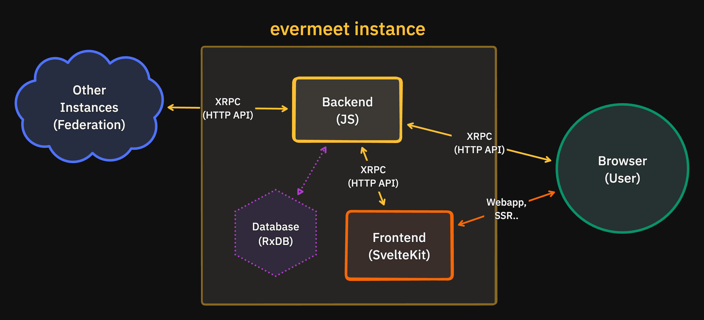

We are currently developing a reference implementation [`@evermeet/evermeet`](https://github.com/evermeet/evermeet). This implementation is written in JavaScript, and executed using [Node.js](https://nodejs.org), [Deno](https://deno.com/) or [Bun](https://bun.sh/) runtime environment.

Future plan is to create implementations in other languages such as Rust or Go.

## Evermeet Instance

Evermeet Instance is the term for an application that contains both a [Backend](#backend-api) as an API and a [Frontend](#frontend-web) for clients.

## Backend (api)

The backend is the central part of an evermeet instance:

* handles most of the workflows
* connected to the [Database](#database) where the data is stored
* communicate with the [Frontend](#frontend-web) and clients
* communicate with other instances within the [Federation](/specs/federation)

Backend source code: [@evermeet/api](https://github.com/evermeet/evermeet/tree/main/packages/api)

### JavaScript Runtime

Backend is runtime-agnostic, supports all major server-side JavaScript runtime environments: [Node.js](https://nodejs.org/), [Deno](https://deno.com/) and [Bun](https://bun.sh/).

### HTTP & WebSocket API

Backend communicate with [Frontend](#frontend-web), clients and external instances through HTTP & WebSocket API ([XRPC](/specs/xrpc)) endpoints defined by [Lexicons](/specs/lexicon).

### HTTP frameworks

Due to the runtime-agnostic approach, the use of various web frameworks is currently available:
* [ElysiaJS](https://elysiajs.com/) (Bun)
* [Fastify](https://fastify.dev/) (Bun, Deno, Node)
* [Express](https://expressjs.com/) (all) (planned)

### Database

As a database, we currently use the storage-agnostic solution [MikroORM](https://mikro-orm.io/).

Storage that can be used:
* [MongoDB](https://mongodb.com/) / [FerretDB](https://www.ferretdb.com/)
* [PostgreSQL](https://www.postgresql.org/)
* [MySQL](https://www.mysql.com/) / [MariaDB](https://mariadb.org/)
* [SQL Server](https://www.microsoft.com/en-us/sql-server)
* [SQLite](https://www.sqlite.org/) / [libsql](https://github.com/tursodatabase/libsql) - embedded

----
## Frontend (web)

The web user interface through which users interact with the evermeet instance.

The frontend is written as [Single-page Application](https://en.wikipedia.org/wiki/Single-page_application) (SPA) using [SvelteKit](https://kit.svelte.dev/) powered by [Svelte](https://svelte.dev/) and [Vite](https://vitejs.dev/). For the communication with the [Backend](#backend-api) the HTTP API ([XRPC](/specs/xrpc)) is used.

The frontend supports all modern standards including support for Server-side Rendering (SSR) for legacy browsers, bots and faster loading.

Frontend source code: [@evermeet/web](https://github.com/evermeet/evermeet/tree/main/packages/web)

### CSS/UI Tools

* [Tailwind CSS](https://tailwindcss.com/) - CSS framework
* [DaisyUI](https://daisyui.com/) - CSS component library
* [Melt UI](https://melt-ui.com/) - headless UI library